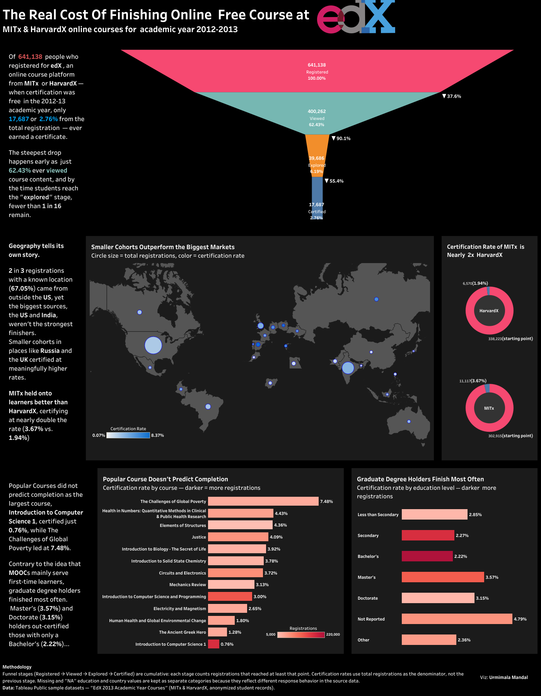

# tableau-portfolio
Interactive Tableau Public dashboards by Urmimala Mandal
# Tableau Portfolio: Urmimala Mandal

Dashboards built in Tableau Public. Click any preview to open it on Tableau Public.

---

## The Real Cost of Finishing an Online Free Course at edX

Of 641,138 people who registered for MITx and HarvardX courses on edX in the 2012–13
academic year, when certificates were still free, only 17,687 (2.76%) earned one.
This dashboard traces where learners drop off, and who actually finishes.

**Key findings**
- The steepest drop comes first: only 62.43% of registrants ever viewed course content.
- MITx certified at nearly double HarvardX's rate (3.67% vs. 1.94%).
- The biggest markets, the US and India, weren't the strongest finishers; smaller
  cohorts such as Russia and the UK certified at higher rates.
- Popularity didn't predict completion: Introduction to Computer Science 1 certified
  just 0.76%, while The Challenges of Global Poverty led at 7.48%.
- Graduate degree holders finished most often: Master's 3.57% and Doctorate 3.15%,
  against 2.22% for Bachelor's.

**Data:** edX MITx & HarvardX 2013 dataset (Tableau Public sample)  
**Tools:** Tableau Public  
**[View the dashboard on Tableau Public →](https://public.tableau.com/app/profile/urmimala.mandal/viz/TheRealCostOfFinishingOnlineFreeCourseatedX/Dashboard3)**
