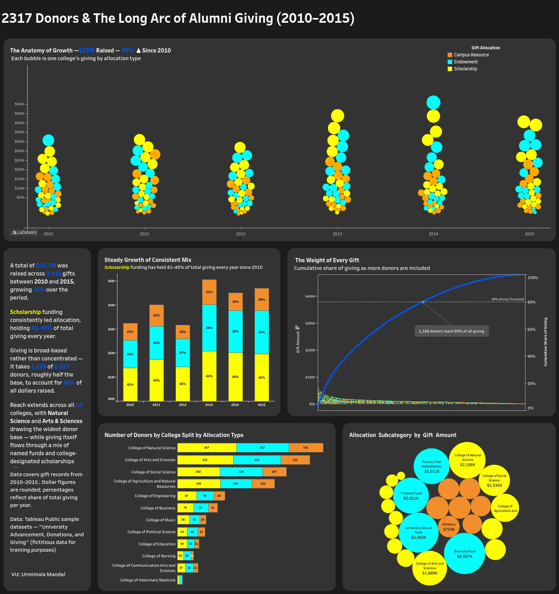

# tableau-portfolio
Interactive Tableau Public dashboards by Urmimala Mandal
# Tableau Portfolio: Urmimala Mandal

Dashboards built in Tableau Public. Click any preview to open it on Tableau Public.

---

## The Real Cost of Finishing an Online Free Course at edX

Of 641,138 people who registered for MITx and HarvardX courses on edX in the 2012–13
academic year, when certificates were still free, only 17,687 (2.76%) earned one.
This dashboard traces where learners drop off, and who actually finishes.

**Key findings**
- The steepest drop comes first: only 62.43% of registrants ever viewed course content.
- MITx certified at nearly double HarvardX's rate (3.67% vs. 1.94%).
- The biggest markets, the US and India, weren't the strongest finishers; smaller
  cohorts such as Russia and the UK certified at higher rates.
- Popularity didn't predict completion: Introduction to Computer Science 1 certified
  just 0.76%, while The Challenges of Global Poverty led at 7.48%.
- Graduate degree holders finished most often: Master's 3.57% and Doctorate 3.15%,
  against 2.22% for Bachelor's.

**Data:** edX MITx & HarvardX 2013 dataset (Tableau Public sample)  
**Tools:** Tableau Public  
**[View the dashboard on Tableau Public →](https://public.tableau.com/app/profile/urmimala.mandal/viz/TheRealCostOfFinishingOnlineFreeCourseatedX/Dashboard3)**

---
---

## 2,317 Donors & The Long Arc of Alumni Giving (2010–2015)

A total of $24.7M was raised across 3,913 gifts between 2010 and 2015, growing 45%
over the period. This dashboard looks at how that giving grew, where it went, and
how widely it was shared across donors and colleges.

**Key findings**
- Scholarship funding consistently led allocation, holding 41–45% of total giving every year.
- Giving is broad-based rather than concentrated: it takes 1,168 of 2,317 donors,
  roughly half the base, to account for 80% of all dollars raised.
- Reach extends across all 12 colleges, with Natural Science and Arts & Sciences
  drawing the widest donor base.
- Giving flows through a mix of named funds and college-designated scholarships alike.

**Also rebuilt as a scrollytelling web story:** [live page](https://umtan.github.io/alumni-giving-story/),
made with D3.js, HTML, CSS and JavaScript ([code on GitHub](https://github.com/umtan/alumni-giving-story))

**Data:** University Advancement, Donations, and Giving (Tableau Public sample, fictitious data)  
**Tools:** Tableau Public, Excel Power Query  
**[View the dashboard on Tableau Public →](https://public.tableau.com/app/profile/urmimala.mandal/viz/2317DonorsTheLongArcofAlumniGiving20102015/Dashboard24)**
